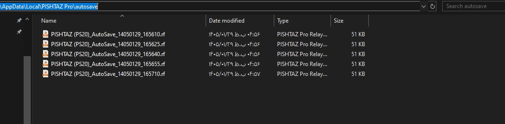
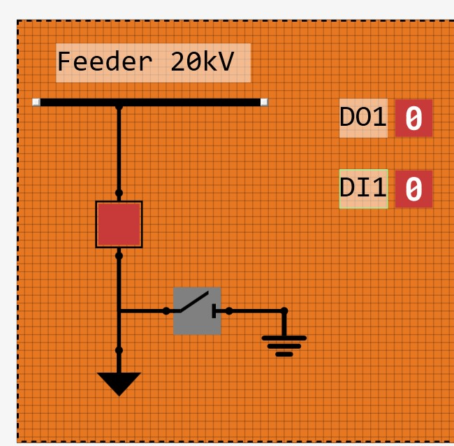
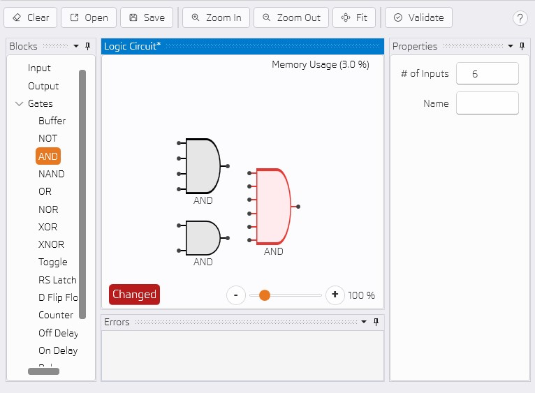
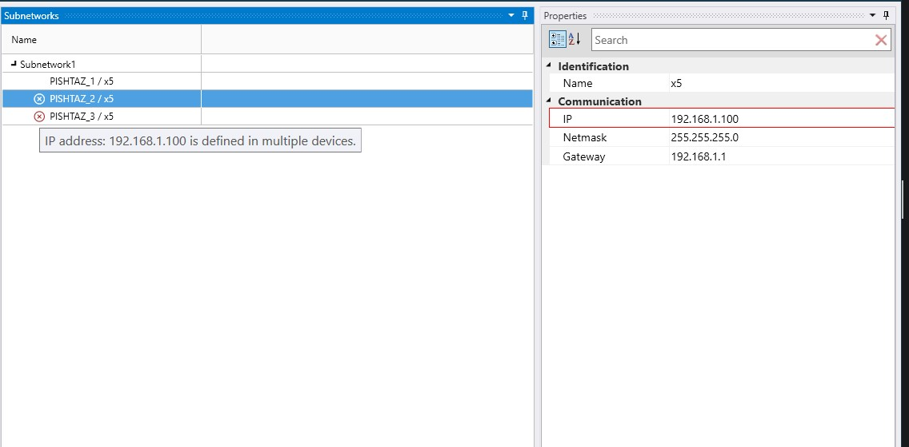
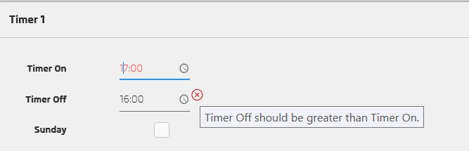

# What's New in 1.10.2

---

## Add auto-save service for setting files every 5 minutes with rotation of latest 5 files

----------------------

## Add binary indicator in bay

----------------------

## Make gates bigger when input count increases in logic view

----------------------

## Change AP uniqueness check from name-based to IP-based in same subnetwork

----------------------

## Add validation that "Timer Off" must be greater than "Timer On" in timer settings

----------------------

## Additional Improvements & Fixes

- Show error if Timer On/Off has invalid value.
- Home page improvement. 
- Buffer gate has 6 outputs.
- Show message when trying to edit in read only mode. 
- Update system configurator library.
- User can import icd file for a relay.
- Set time tolerance parameter in XRIO based on protection function type.
- Add validation for IP and Subnet Mask settings. 
- Prevent direct connection from input to output in logic view.