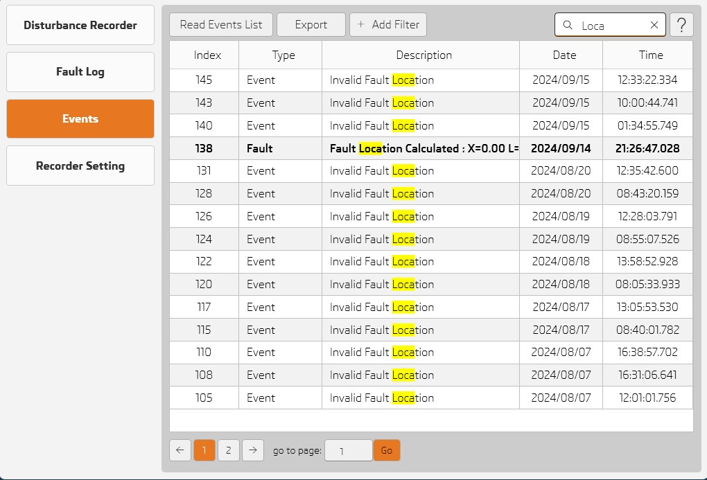
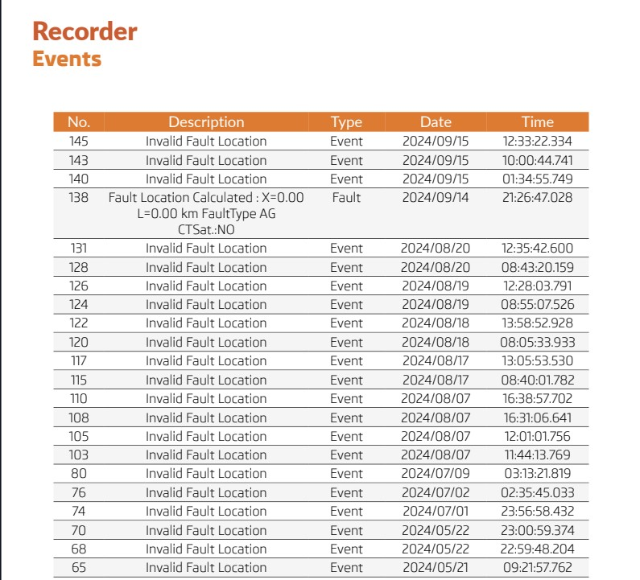
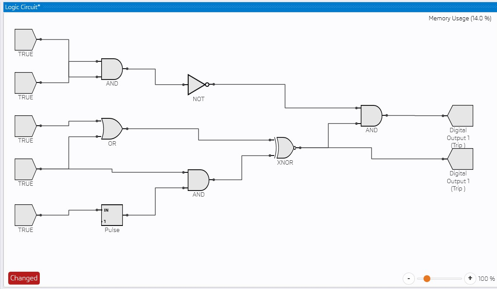
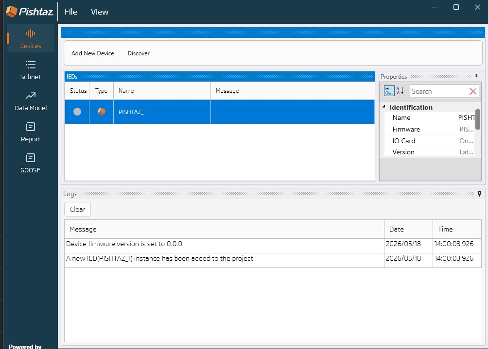
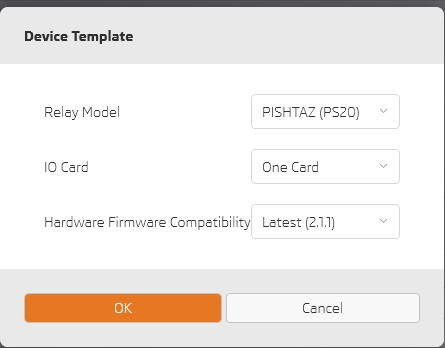
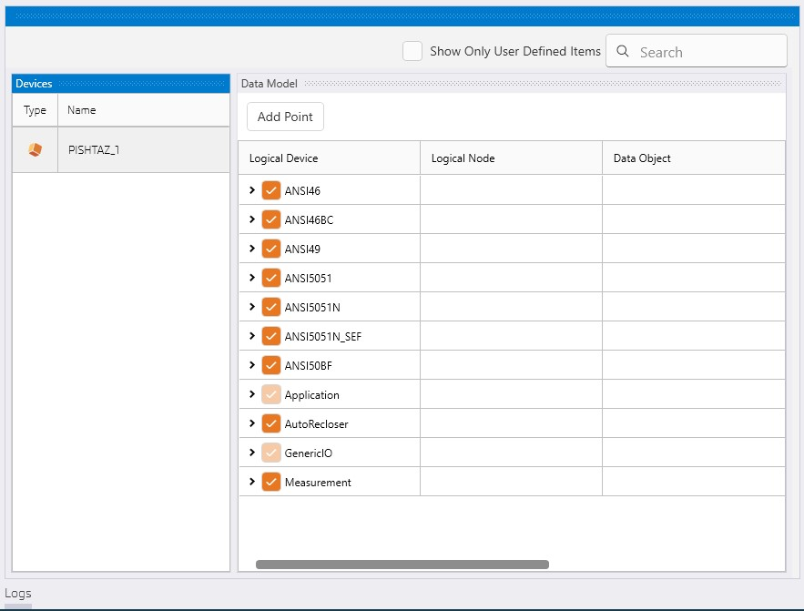
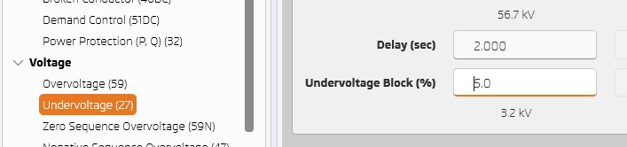
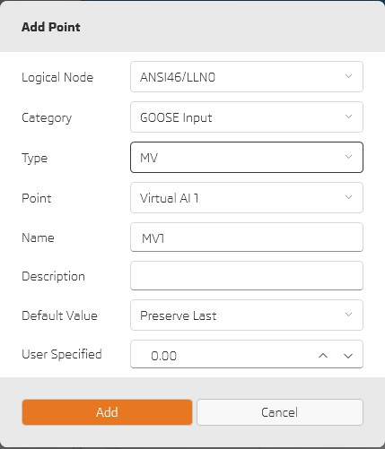

# What's New in 1.11.2

---

## 📤 Export Only Filtered Items in Events, Security Events, Fault Log, and Disturbance Recorder

- Users can now export only the filtered items from the Events, Security Events, Fault Log, and Disturbance Recorder views, allowing for more focused and efficient data extraction.

----------------------

## 🛠️ Logic Editor Improvements

- Enhanced auto-layout algorithm for improved diagram readability.
- Introduced undo/redo functionality for greater editing flexibility.
- Added panning support using Scroll (vertical) and Shift + Scroll (horizontal).
- Enabled precise element movement in defined step increments.

----------------------

## 📋 View Logs in Docking Panel

- Application logs are now accessible directly within a dedicated docking panel for easier monitoring and troubleshooting.

----------------------

## 🔧 Specify Firmware Version When Adding a New Device

- Users can now specify the firmware version directly within the Add Device dialog. Please note that certain features may not be available on older firmware versions.

----------------------

## ⚙️ Enable / Disable Data Model Points

- Users can now enable or disable individual data model points. Up to five enabled logical devices are supported in Edition 1.

----------------------

## ⚡ Undervoltage Equivalent Value

- Updated the calculation and handling of the undervoltage equivalent value for improved accuracy.

----------------------

## ➕ Added MV / CMV Virtual Points

- Introduced support for MV and CMV virtual points, expanding the range of available data modeling options.
