# What's New in 1.11.24

---

## 🔀 Analog Logic Gates in the Logic Editor

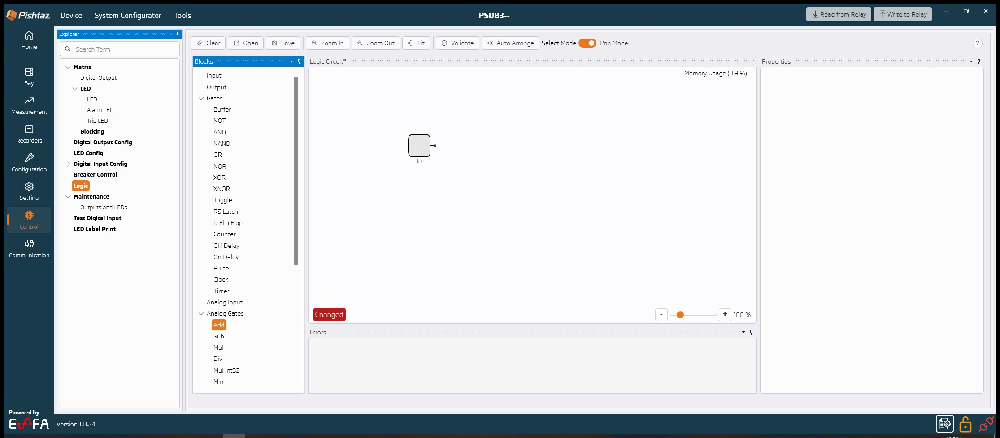

- The Logic Editor now supports analog (CFC-style) logic alongside digital logic on a single shared diagram, with up to 10 analog gates.
- Analog gates include arithmetic (Add, Subtract, Multiply, Divide), minimum and maximum, comparison, limiting, setpoint, absolute value, square root, live-zero, deadzone/hysteresis, and multiplexer functions.
- Analog inputs can be taken from measurements, RTD and GOOSE sources, from a user-defined constant, or from the output of another analog gate.
- Mixing analog and digital signals is done through dedicated converter gates, so a diagram can never be wired in a way the relay cannot execute.
- The multiplexer gate takes its data inputs on the left and its selector inputs on the top, and the selectors are driven by digital signals rather than a fixed configuration value.
- Circuit Breaker Failure (CBF) signals are now available as logic inputs.

----------------------

## 🗂️ Data Model Bulk Actions, Duplicate, and Point Capacity

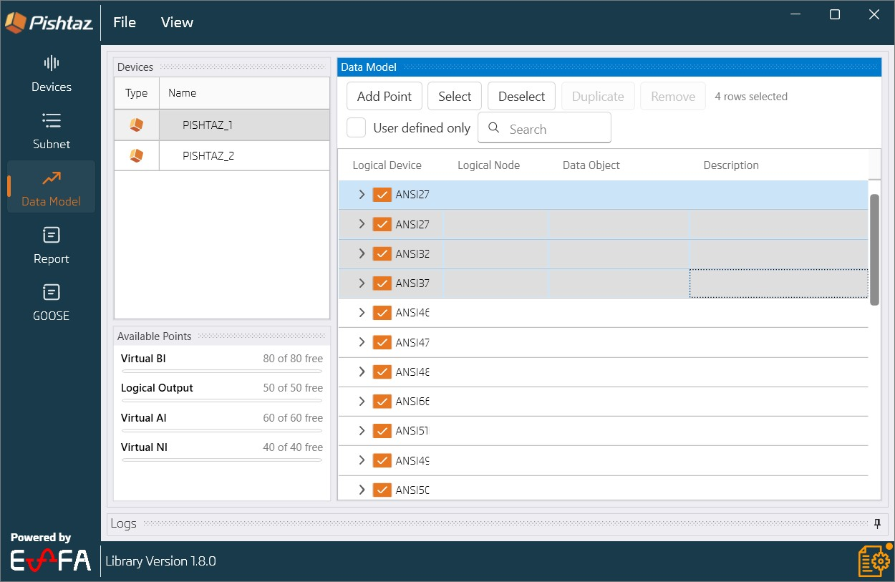
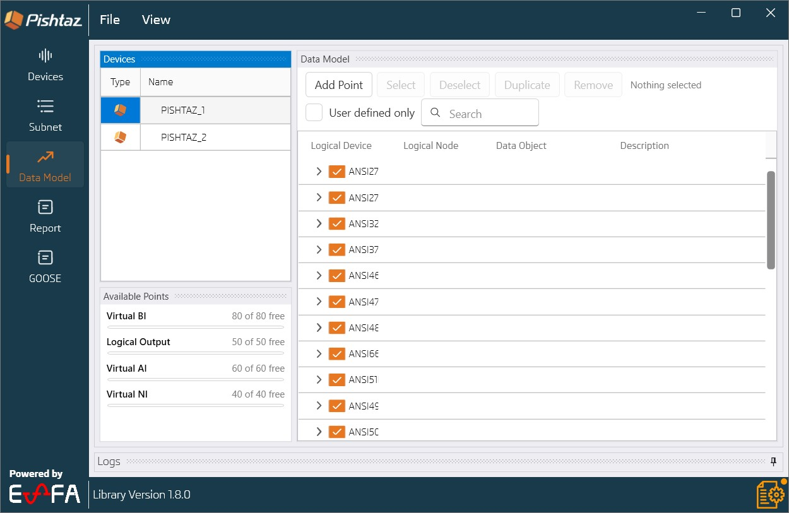

- Select multiple rows in the Data Model page and enable or disable them all at once with the new bulk Select / Deselect actions.
- User-defined and GOOSE input points can now be duplicated, with the copy automatically named by its own index.
- A new point availability panel shows how much of the virtual point capacity is already in use, so remaining capacity is visible before adding points.
- User-defined and GOOSE input points can now be enabled and disabled like any other data model point.
- The filter and search controls are folded into the toolbar, the toolbar wraps instead of clipping on narrow windows, and the page reclaims the vertical space previously wasted above the table.

----------------------

## ⚡ Much Faster Data Model Page

- Toggling a node in the Data Model page no longer freezes the application. Edits are applied immediately and the dependent pages refresh in the background.
- The page now builds only the rows that are actually visible instead of the entire model up front, so opening the page, scrolling, and switching devices are all noticeably faster on large data models.
- The tree was rebuilt on a new virtualized table, which keeps scrolling smooth even on the largest models.

----------------------

## 📑 Report Control Block and Dataset Capacity Limits

- A device can hold 20 buffered report control block instances, and that budget is now enforced and shown in the user interface instead of failing later when writing to the device. A block configured for several clients is instantiated once per client, so it uses that many of the budget; unbuffered blocks are not limited and do not count.
- The 100 data object per dataset limit is enforced and surfaced as you build a dataset, in both the Reports and GOOSE editors, and the count now updates immediately when an FCDA is deleted.
- Report control blocks are badged with their type (URCB / BRCB) and their configured client count, so the list can be read at a glance.
- Report control block and GOOSE publisher properties now carry descriptions taken from IEC 61850, shown as tooltips in the property grid.

----------------------

## 📡 GOOSE Improvements

- GOOSE publisher MAC addresses are now written in uppercase, and new publishers are automatically allocated an address that does not collide with an existing one.
- The source catalog now shows every GOOSE source of a data object rather than only the first one.
- GOOSE measurement reading was improved, and the not-connected flag on GOOSE digital signals is now reported correctly.

----------------------

## 📈 Impedance Zone Charts for Pilot Zone and Switch-on-to-Fault

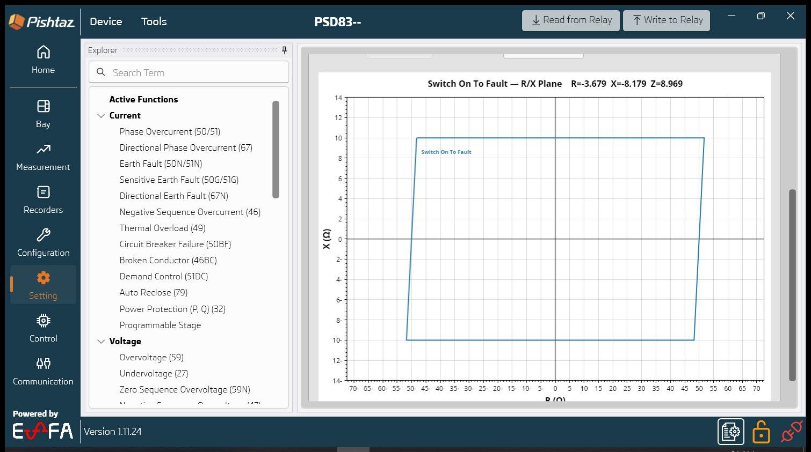
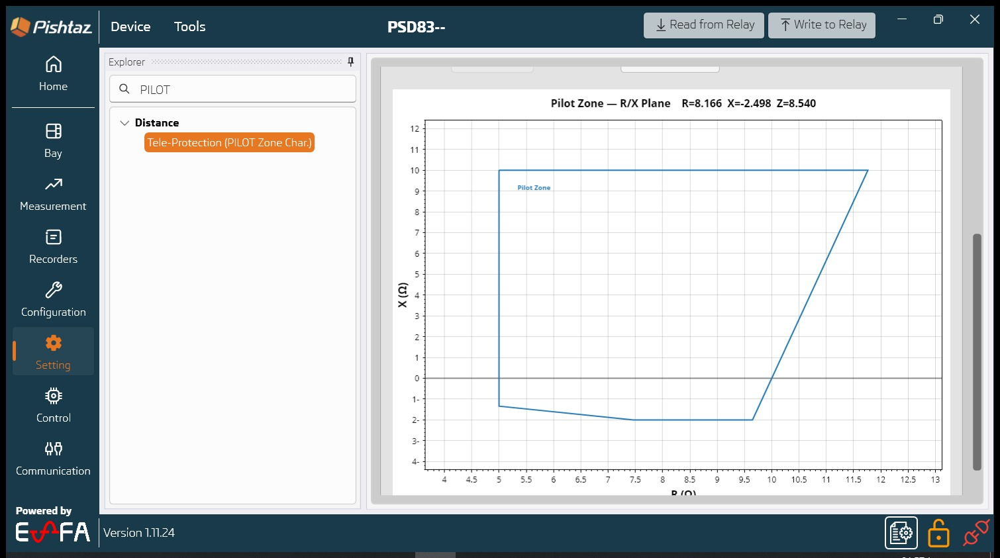

- The impedance zone chart is now available for the Pilot zone and for the Switch-on-to-Fault (SOTF) function, in addition to the existing distance zones.
- The quadrilateral and Mho characteristic formulas were reviewed against the relay and corrected, so the plotted characteristic now matches what the relay actually evaluates.
- Several drawing issues were fixed, including charts drawn with wrong axis limits when no zone was enabled.
- The non-directional option is now offered only for Zone 5, where the relay supports it.

----------------------

## 🌡️ Thermal Overload and Cyber Security for Distance

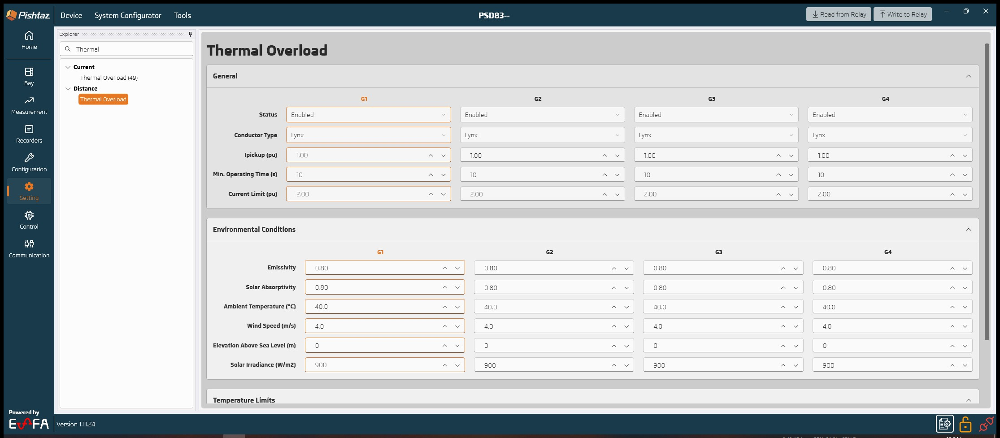

- Distance relays gain a full Thermal Overload section, covering general parameters, environmental conditions, and temperature limits.
- A Cyber Security section and a Source Impedance page were added to the Distance settings.

----------------------

## 🔗 Tele-Protection Communication Settings

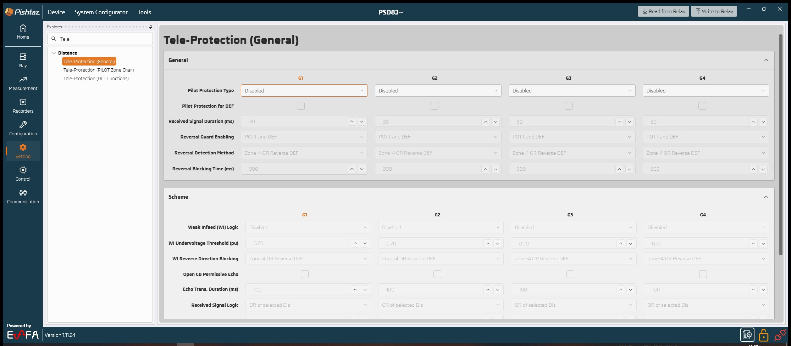

- A new Tele-Protection section adds the POTT (Permissive Overreach Transfer Trip) communication scheme settings.

----------------------

## 🔥 Advanced Overload

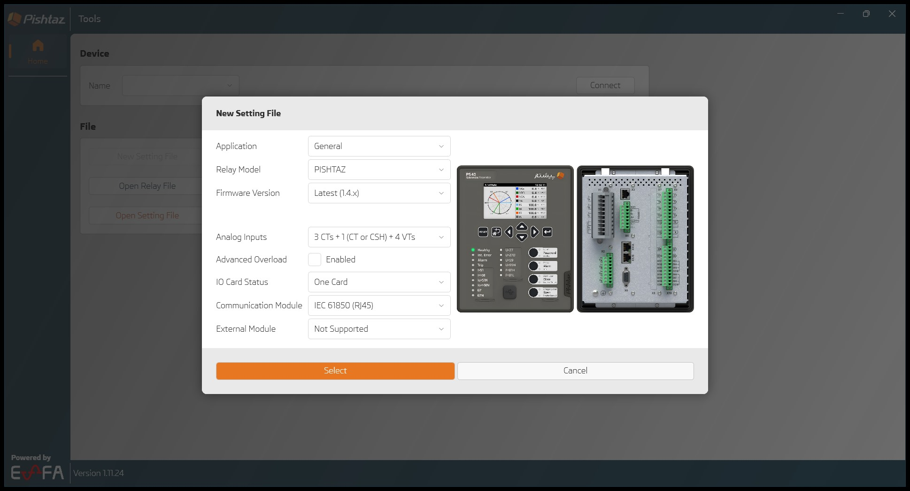

- Advanced Overload support is now read from the device model and stored in the setting file, and the option is hidden on firmware versions that do not support it.
- A new Advanced Overload Pickup signal was added and can be mapped to any output relay, LED, or blocking source.
- Advanced Overload Alarm LED and Trip LED settings were corrected, and the maximum overload current setting that was missing is now present.

----------------------

## 📋 Copy and Paste in the Bay Editor

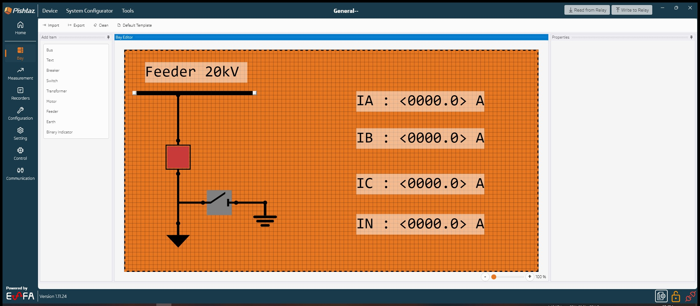

- Bay diagram elements can now be copied and pasted, making it much faster to build repetitive single-line diagrams.
- Up to 32 binary indicators can now be placed on a bay diagram, raised from 10.
- Ring couplers are now shown in the generated single-line diagram schemes.

----------------------

## ⏱️ Reset Delay in Power Protection

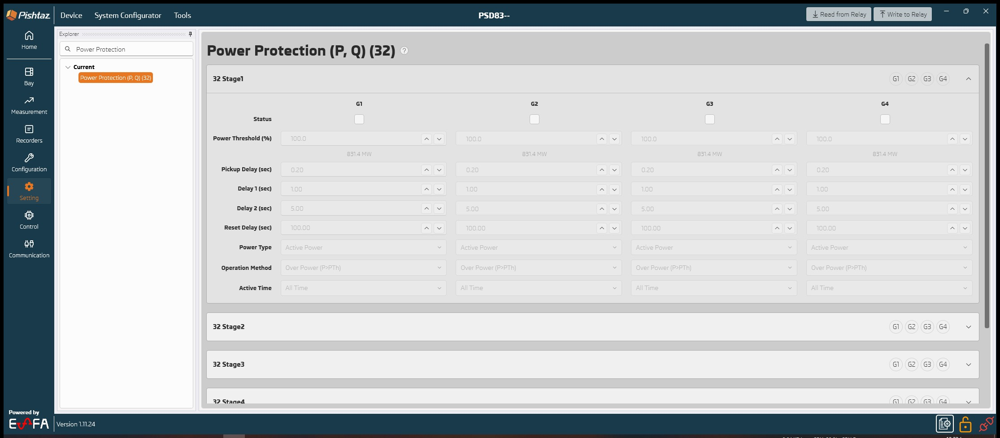

- A Reset Delay setting was added to all six Power Protection stages.

----------------------

## 🖥️ System Configurator Improvements

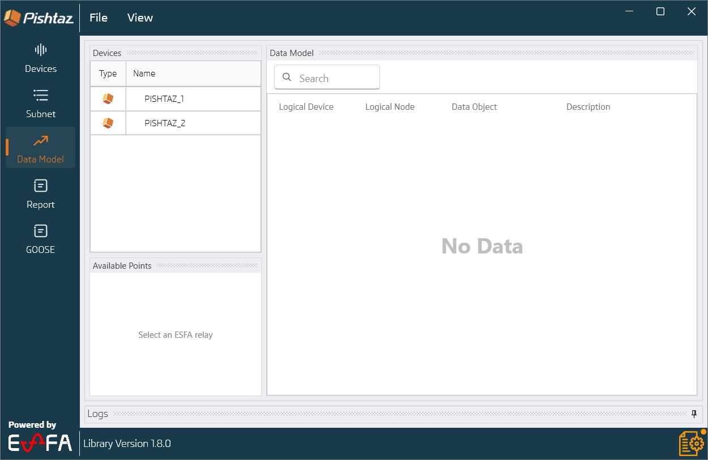

- The firmware version is now read from the relay on every read operation, and it is set automatically when a device is added from PISHTAZ Pro, so firmware-gated features are always offered correctly.
- An ICD file can now be exported even when the device has no subnetwork assignment.
- User-defined point parameters can now be set and edited after the point has been created.
- Fixed an issue when importing an SCD file.
- The System Configurator library was updated to 1.8.0. The selectable relay firmware versions now include 2.1.1, and "Latest" corresponds to 2.1.8.

----------------------

## 📖 User Manual

- A System Configurator user manual is now shipped with the application, in both English and Persian.

----------------------

## 🧾 Other Improvements and Fixes

- PDF reports now start a new page for each fault and each fault log, making printed reports much easier to read.
- The logs pane is more compact and no longer shows milliseconds in the time column, so more entries fit on screen.
- The Load Encroachment type list now offers only the two values the relay supports, Disabled and Enabled.
- The Block option is enabled when "less than" is selected in a programmable stage.
- Only Feeder 1 is shown in the Blocking page, and a missing setting in Feeder 6 was added.
- Unused settings were removed from the Alarm LED and Trip LED views, and the cyber security label was corrected.
- The maximum value of the reset time setting was corrected.
- Fixed a case where the bay diagram was not written to the relay.
- Default settings and settings metadata were reviewed and updated across all relay models.
