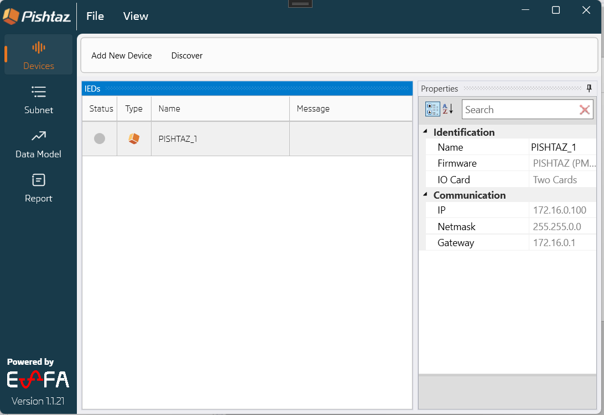
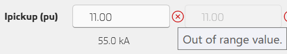
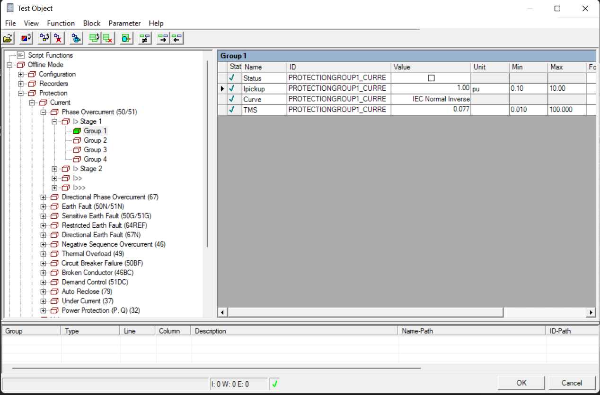
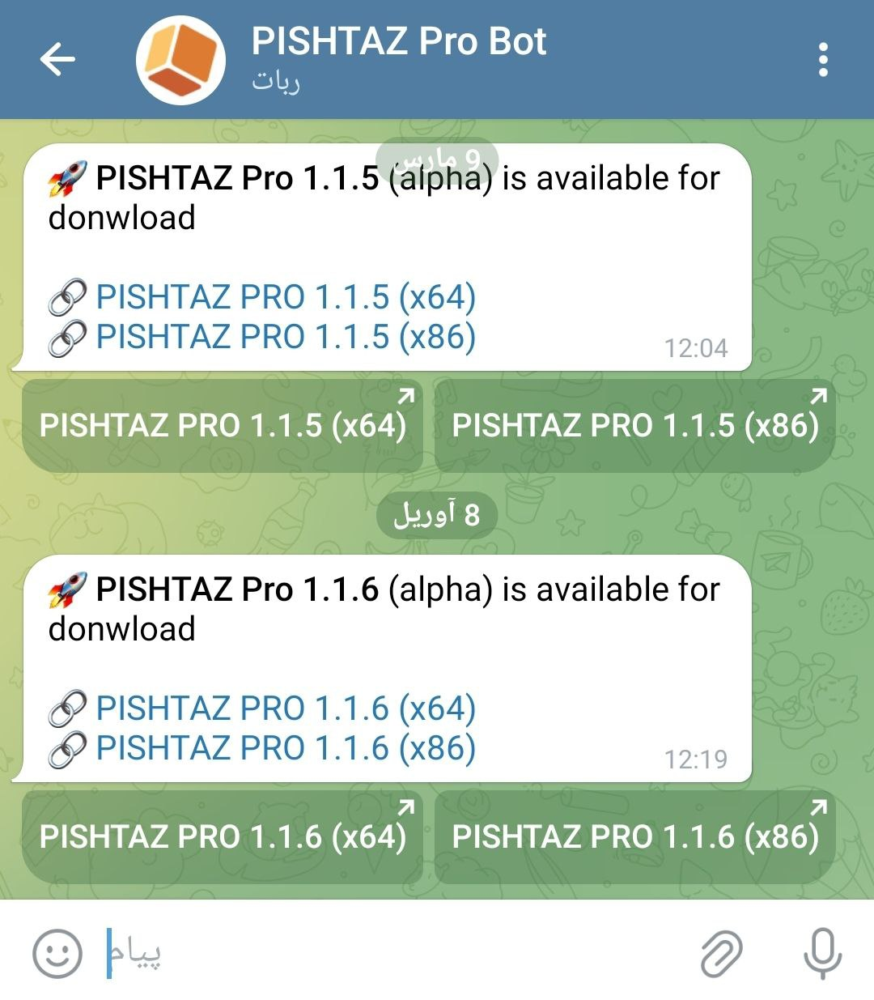
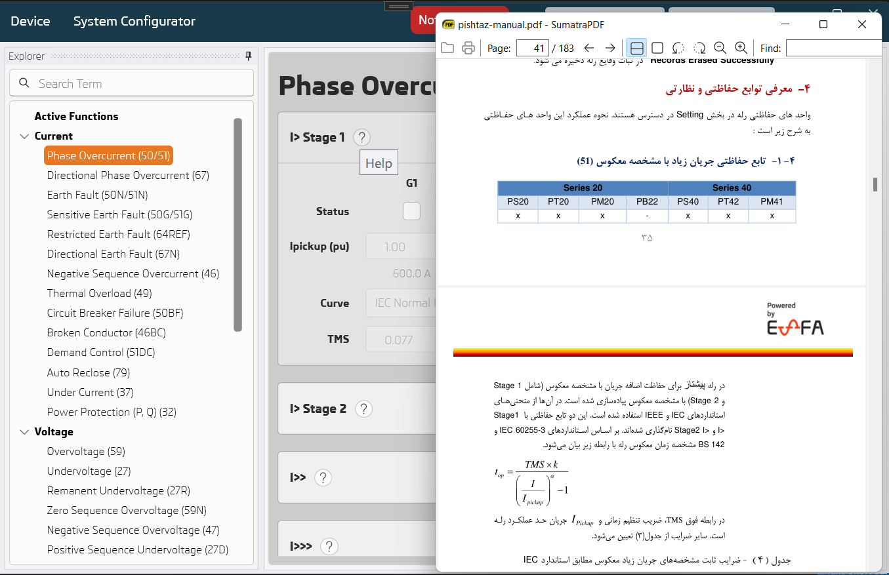
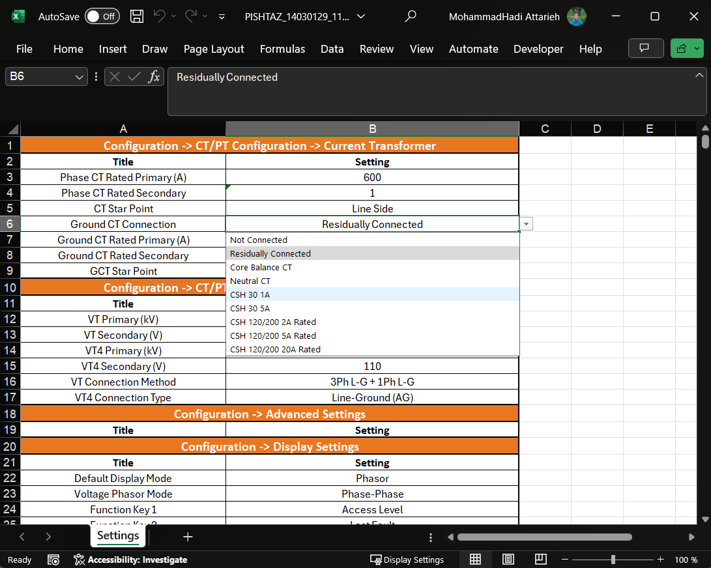
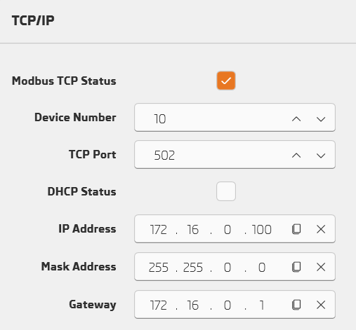
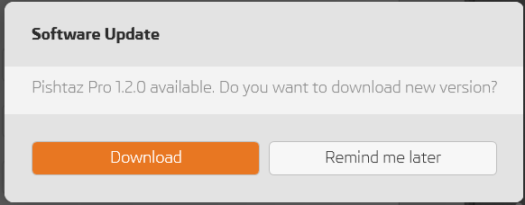
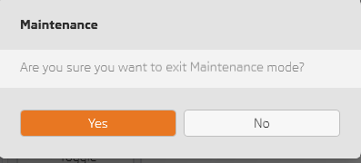

# What's New in 1.2.0

## Pishtaz System Configurator new look and face

- Improve core library
- Improve UI/UX
    - Use new tree element to improve adding dataset 
    - Sync netwrok configuration between PISHTAZ Pro and PISHTAZ System Configurator
    - Add multiple feature to improve connecting to relay process
        - IP suggestion
        - IP duplication check
        - Disallow out of range IP based on subnet mask
        - Smart PISHTAZ relay device discovery 
    - Add docking manager for customizing view

---

## Show alarm when setting value is invalid (out of range, not defined) 

---

## Support Xrio files (Custom Block)

---

## Add telegram bot for release notification

---

## Add User Manual 

---

## Export Settings Excel File

---

## Add Modbus TCP settings 

---

## Notify when new version released.

---

## Prompt when exiting from maintenance mode 

---

## Other improvements
- Show progressive loading when possible
- Fix new settings from imported file isn't written after write to relay
- Fix reset Energy/CBWearing issue
- Performance improvement when adding new setting file 
- Don't override device info after reading setting file 
- Implement advanced complex encryption for system configuration communication 
