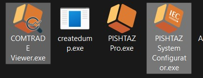
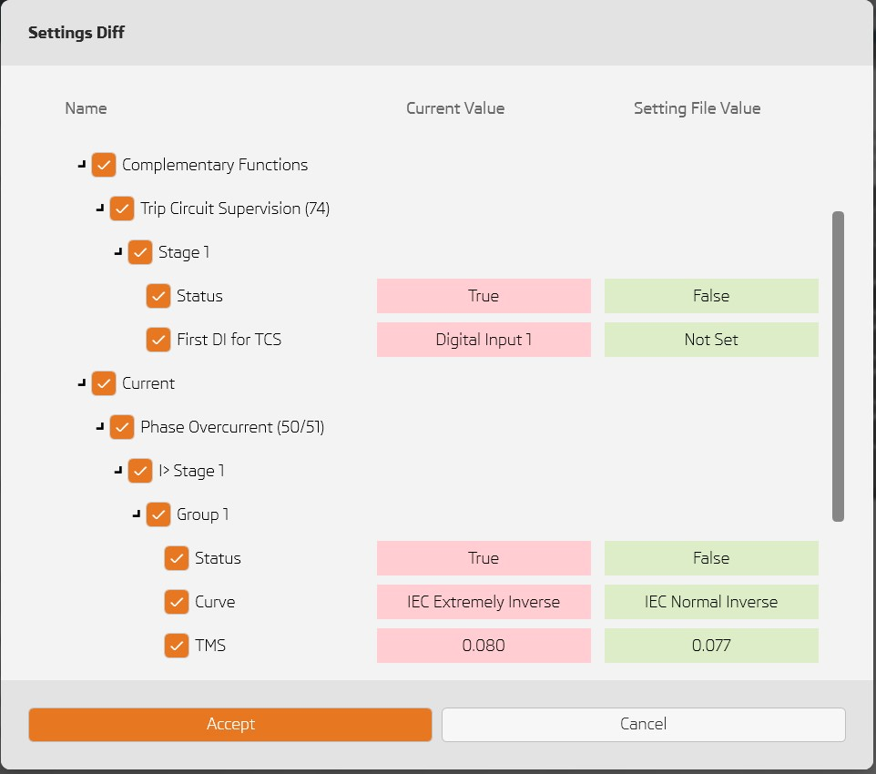
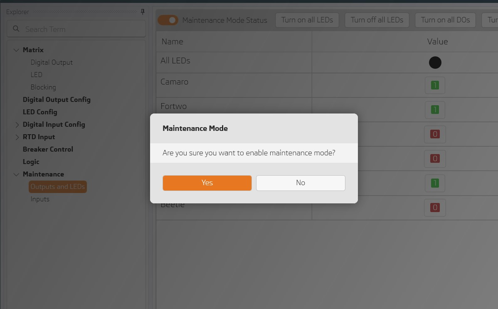
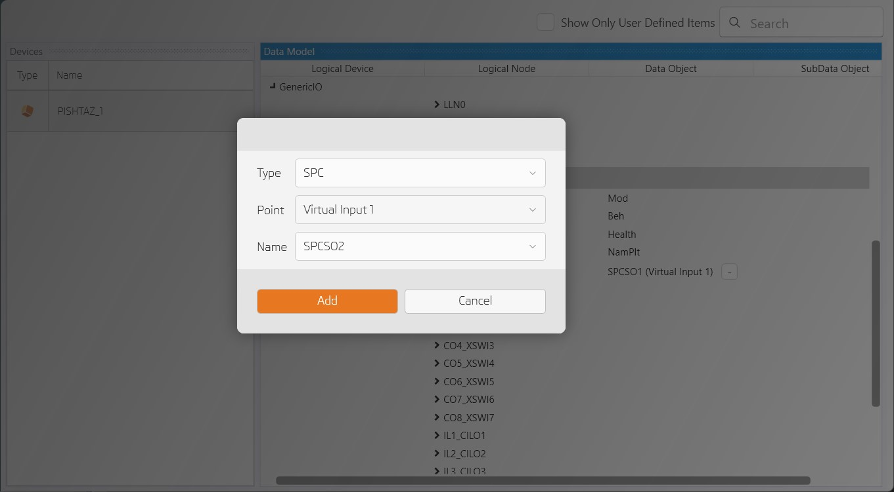

# What's New in 1.3.0

## PISHTAZ System Configurator and COMTRADE Viewer as standalone applications

- New icon for PISHTAZ System Configurator
- Add COMTRADE viewer and PISHTAZ System configurator shortcuts to Windows startup menu

---

## Settings conflict diff viewer

When importing setting file user can show differences between current values and Setting file values and choose which settings to import

---

## Maintenance mode for Digital Inputs

In order to change digital inputs status user is asked to enter maintenance mode. 

---

## Add/Remove virtual points in PISHTAZ System Configurator

---

## Other improvements
- Setup UI/UX improvements
- Improve motor status in measurement
- Fix bugs 
- Add UI for new settings
- Fix equivalent values for voltage/power settings 
