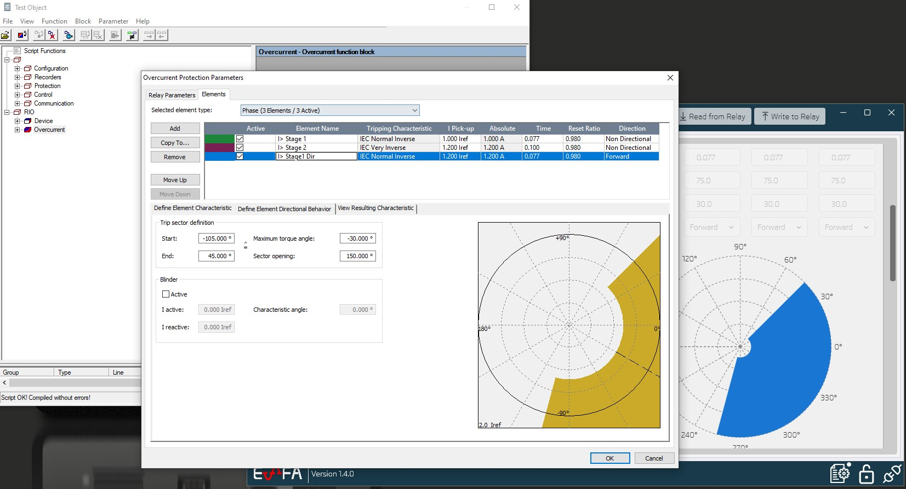
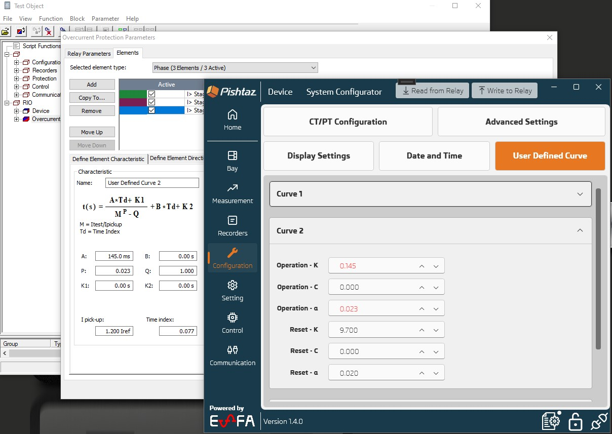
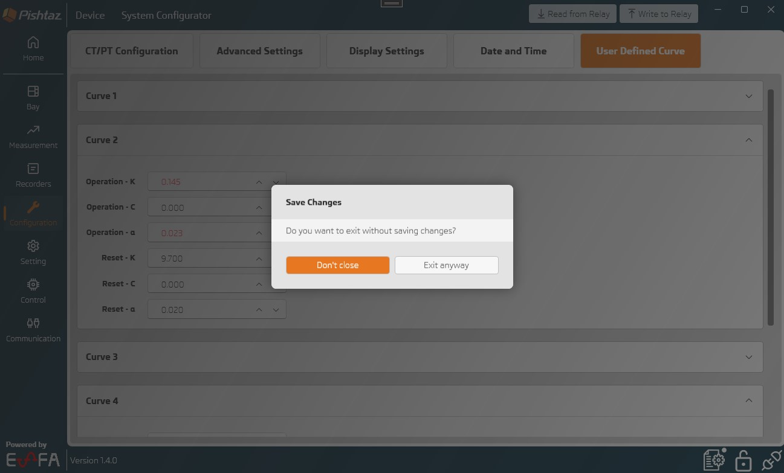
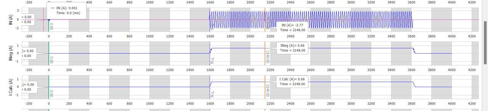
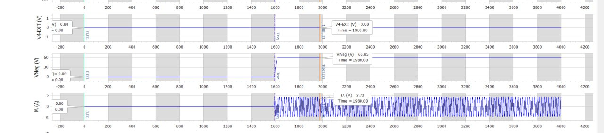
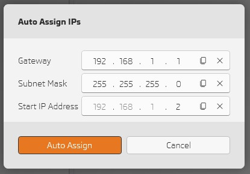
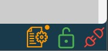
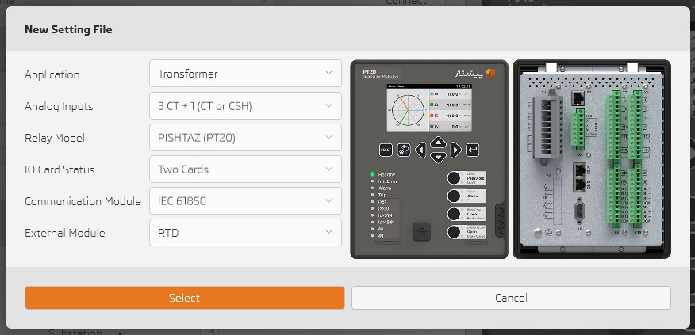
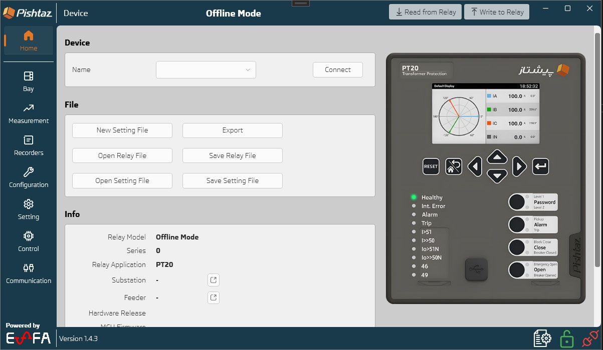

# What's New in 1.4.3

## XRIO: Fully Supported and Superior to DIGSI (Siemens)!

- Now every active overcurrent function stage is exported with exact operation/rest curve characteristics. 
- See element directional behavior 
- Enjoy Testing! 

---

## Don't lose unsaved changes!

You are asked to confirm exiting software if any unsaved changes exist 

---

## New Analog Signals!

# INeg

# VNeg

---

## Auto Assign IPs for Subnet in PISHTAZ System Configurator

Define gateway and subnet then let it auto assign IPs for relays in the subnet  

---

## Small but Informative

- See connection status, access level, new version notification and if there are any unsaved changes directy on the bottm of software in the status bar   

---

## New Setting File Redesign

- See front/back panel when creating new setting file    

---

## Home UI Improvement

- Show relay front panel image based on relay model.     

---

## Other improvements
- Show advanced settings based on relay model
- Confirm when setting file with different relay specification is imported
- Add UI for new settings
- Fix active function status for power protection stage 5/6 
- Fix bugs 
- UI/UX improvements
