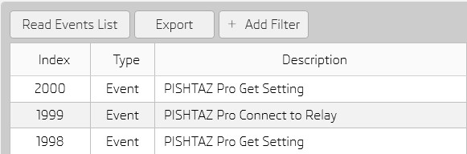
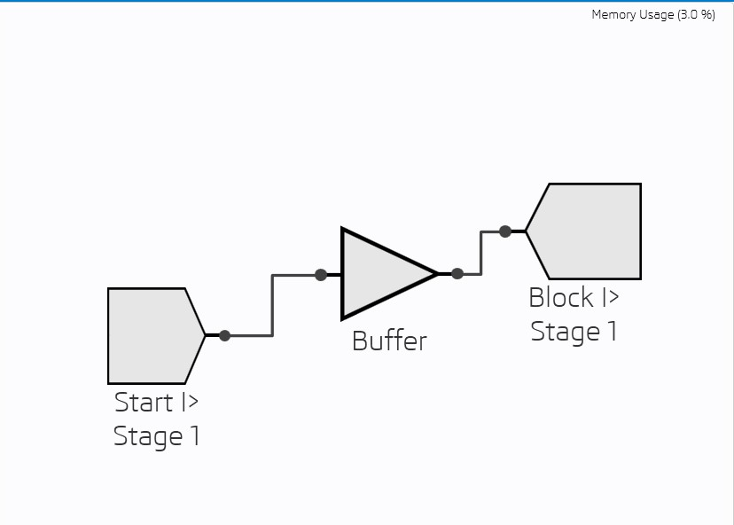
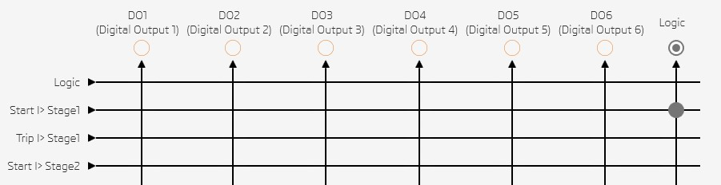
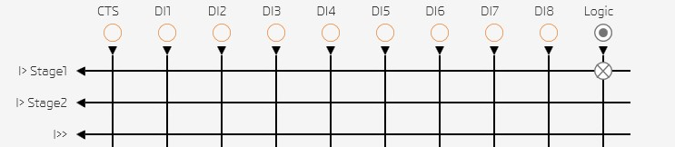
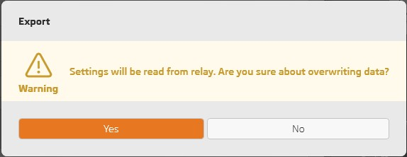
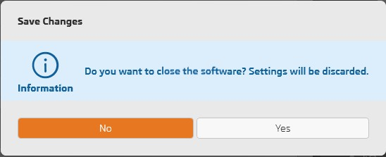
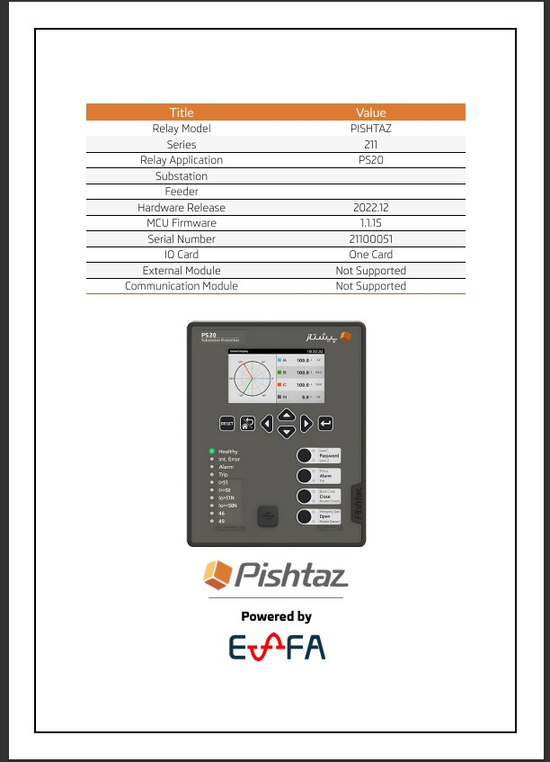
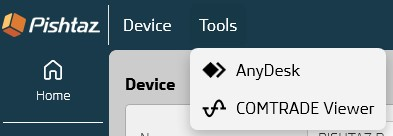
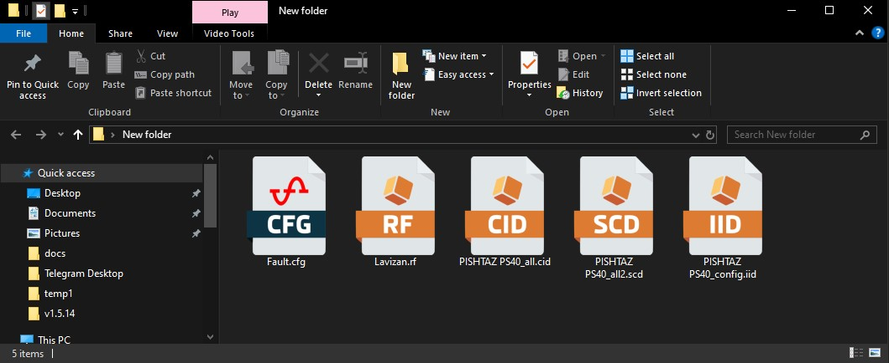
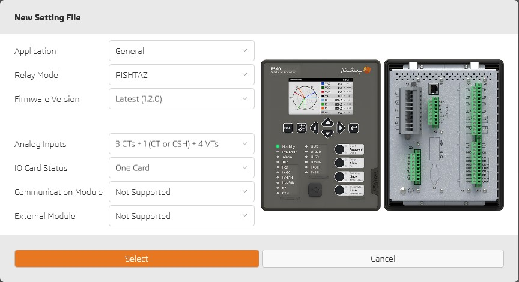

# What's New in 1.5.14

## Export fault list, events or fault logs separately

---

## See signals used in logic diagram 

---

## Lets add color to messages

# Warning

# Information

and more

---

## First report page redesign

---

## Help me!

- Open anydesk remote access software directly from "Tools"   

---

## Double click and Go!

- See supported files immediately by double clicking on the file.      

---

## Don't miss past

- You can create new setting file for previous firmware versions.     

---

## Other improvements
- Fix active function status for VTFF.
- Fix bugs.
- UI/UX improvements.
- Read/Write bay schema with Read from relay and Write to relay.
- Add firmware 1.1.15 support.
- Show Relay Model and Serial Number on software title