# What's New in 1.6.1

## See unsaved changes before writing to relay

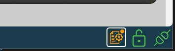
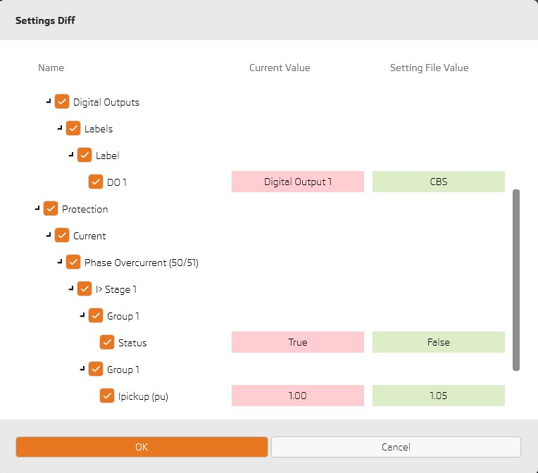

---

## Update bay templates  

# Substation Bay Template
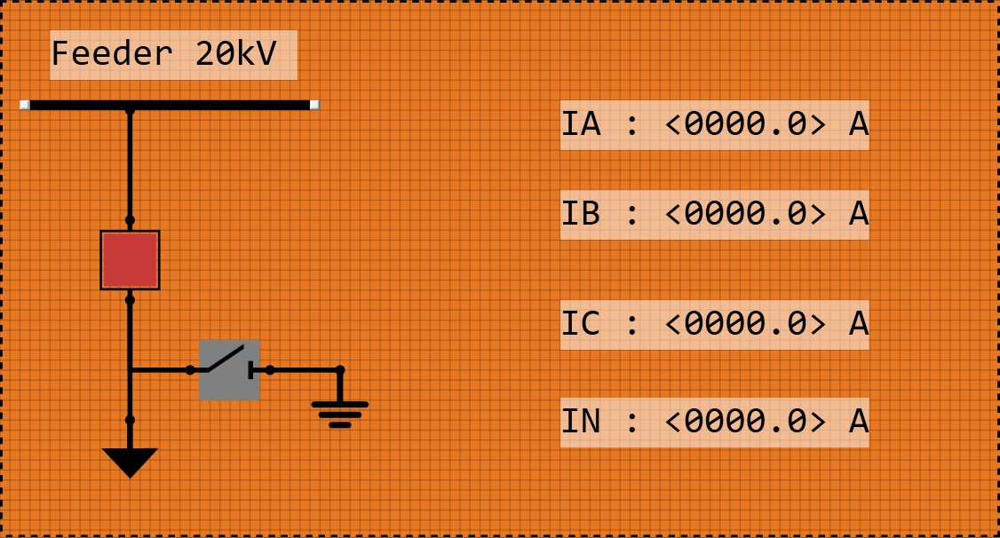

# Transformer Bay Template
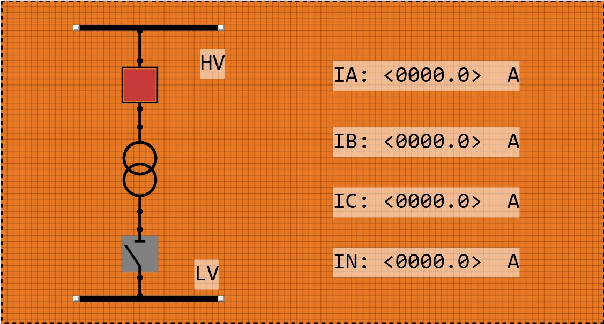

# Motor Bay Template
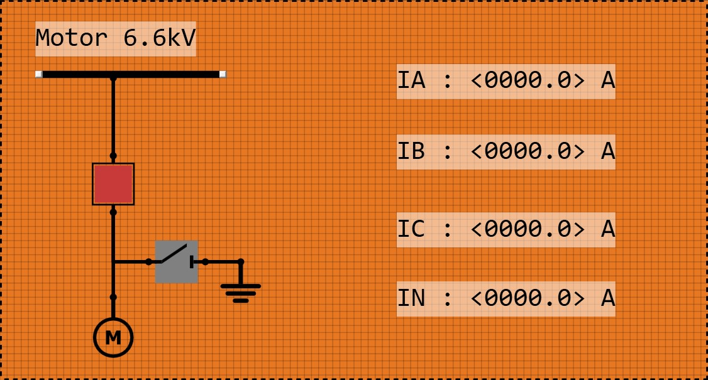

# Busbar Bay Template
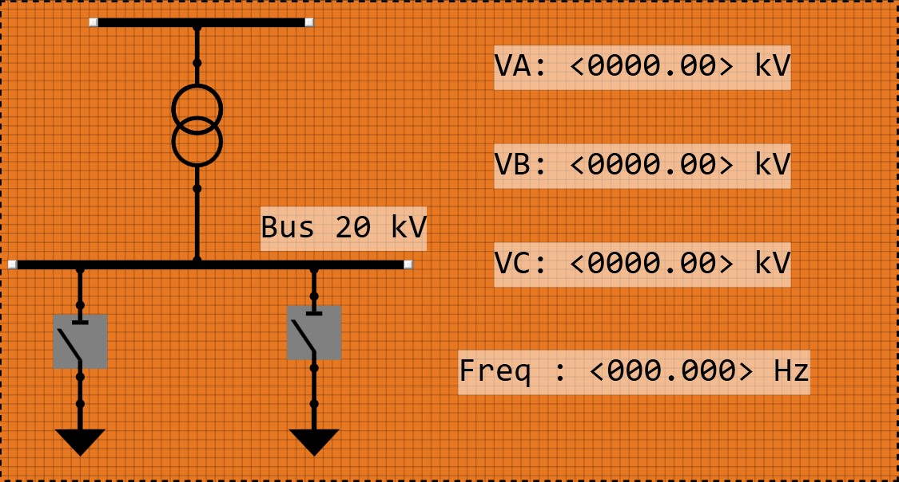

---

## Jump to active function

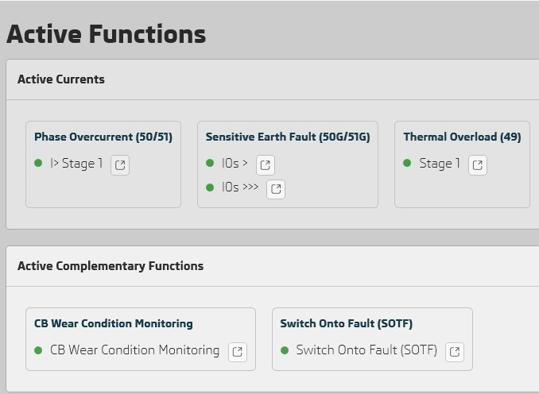

---

## Directional Graph Indicators

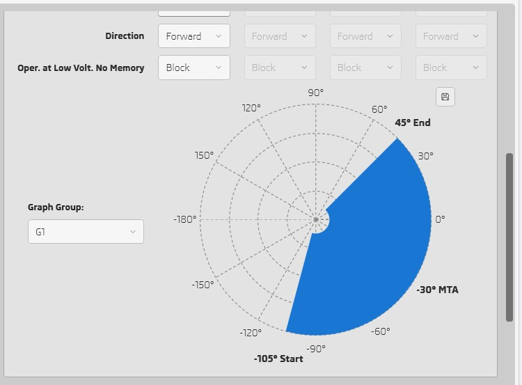

---

## Persian Calendar 

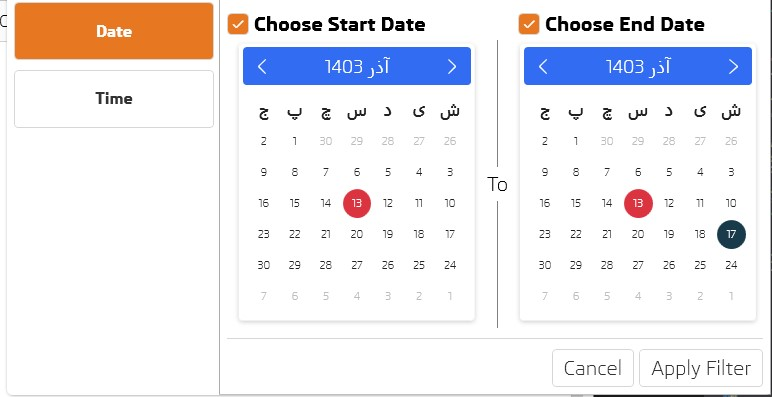

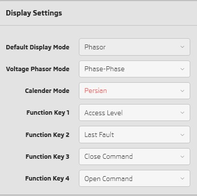

- User can select persian calendar to see or filter records by persian date. It's available for firmware 1.2.0 and above 

---

## Print LED Labels (Superior to Easergy Pro!)

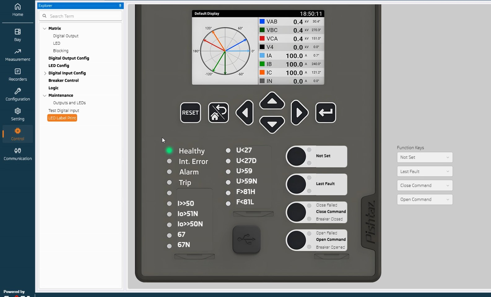
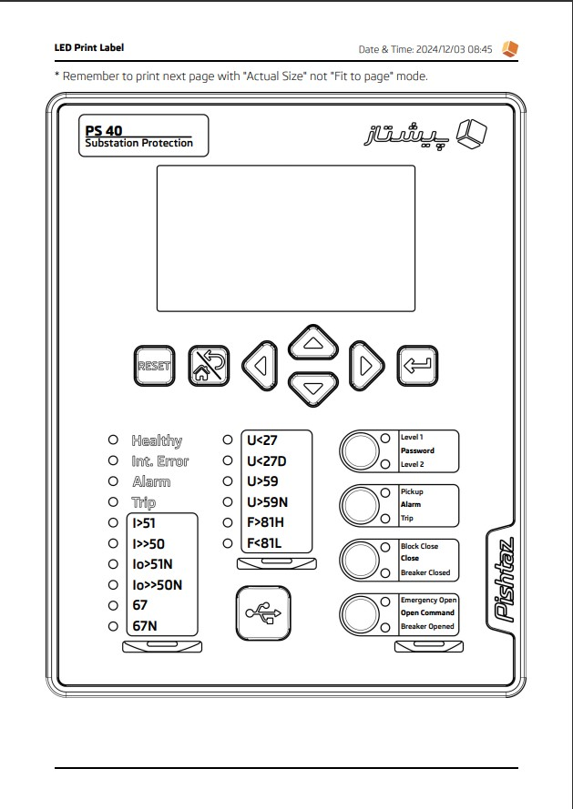
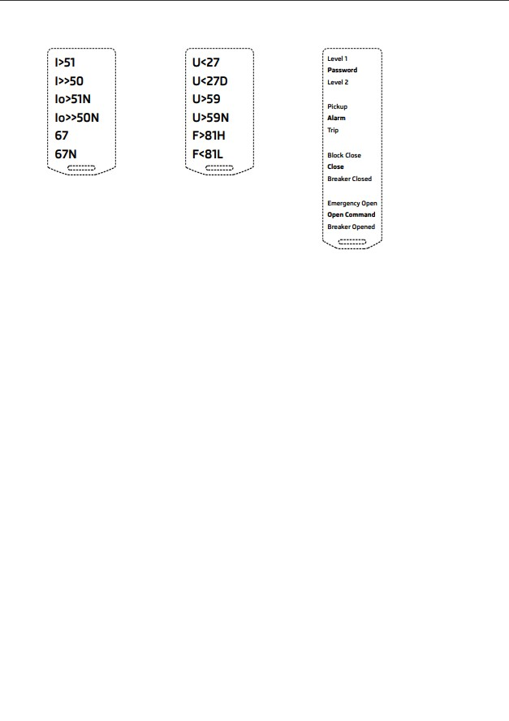

- Easily customize relay front panel labels for all LEDs and function keys then print, cut and enjoy customization.    

- let's compare with Easergy Pro!
  
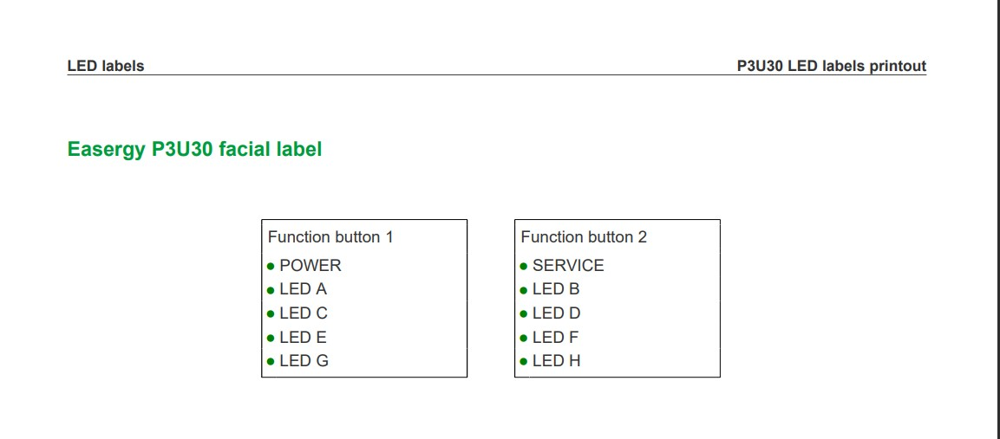

---

## Different colors for each signal in COMTRADE Viewer

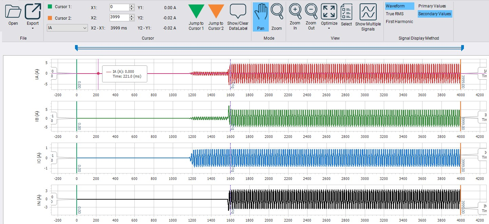

---

## Other improvements
- Add IBias and IDiff signals.
- Fix bugs.
- UI/UX improvements.