# What's New in 1.7.1

---

## Add support for firmware 1.2.0!

- Add SEF and VZero analog signals
- Add Unrestrain Restricted Earth Fault digital signals

### Add security events in recorders
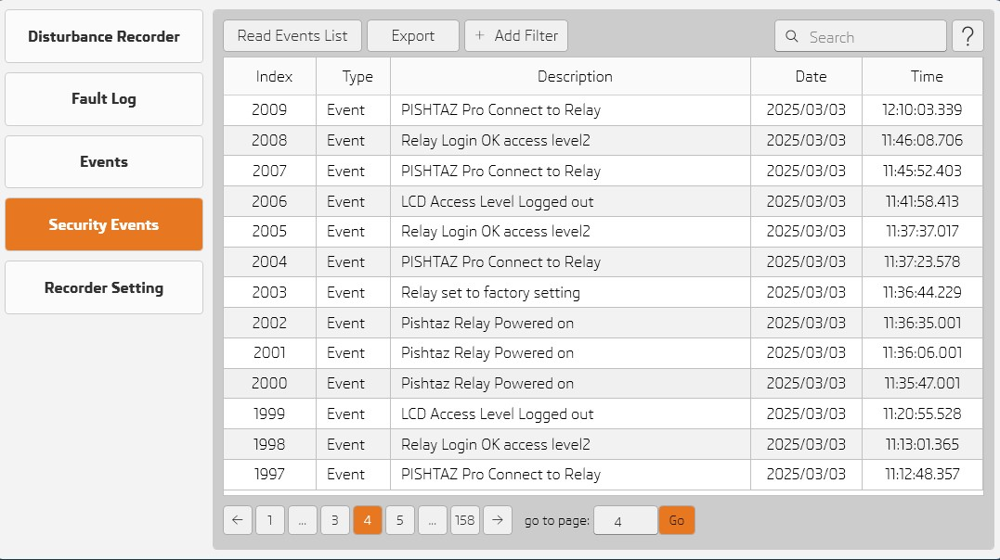

### Add Control Objects in Measurements
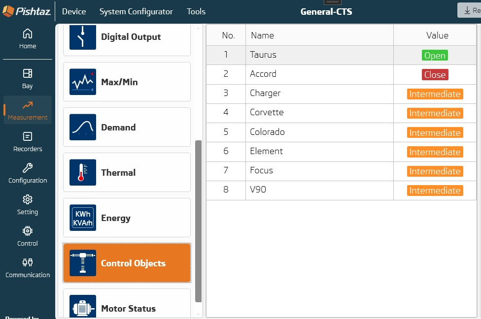

### Add True RMS in Measurements
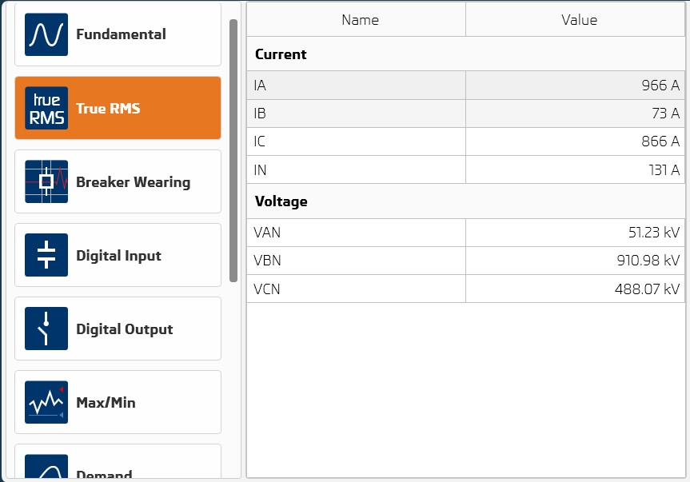

---

## Filter based on event type 
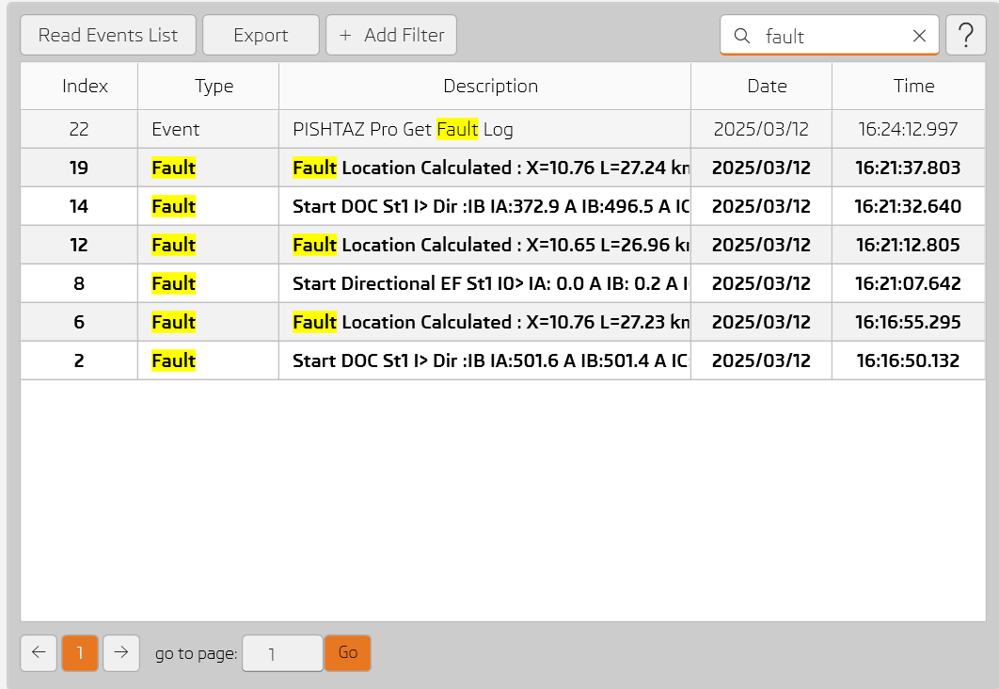

---

## Config Alarm and Trip LEDs 
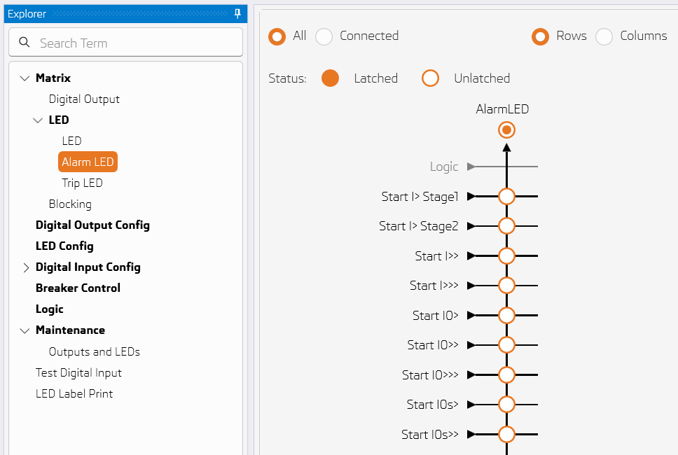

## Column and Row lines are highlighted in output matrix 

---

## Show logic signal configuration in output matrix 

---

## Show MTA and reference voltage vectors in directional graph
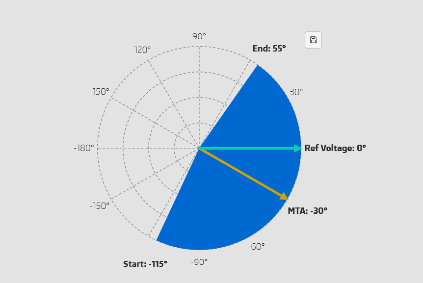

---

## Add DNP3 settings

---

## Add chatter settings

---

## Add wrong attempt protection settings 
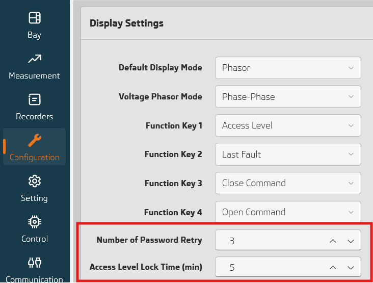

---

## Add timers settings in output matirx 
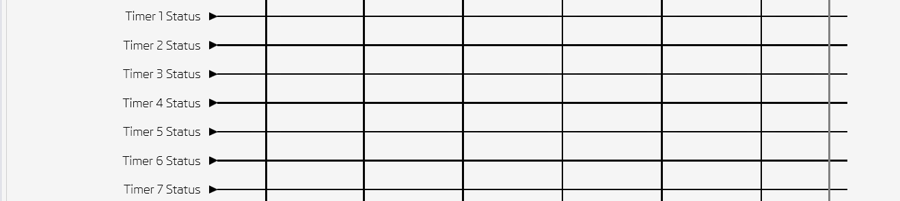

---

## Add delay settings in power protection  
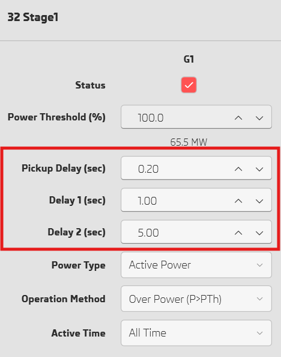

---

## Decrease matrix loading time by 80%  
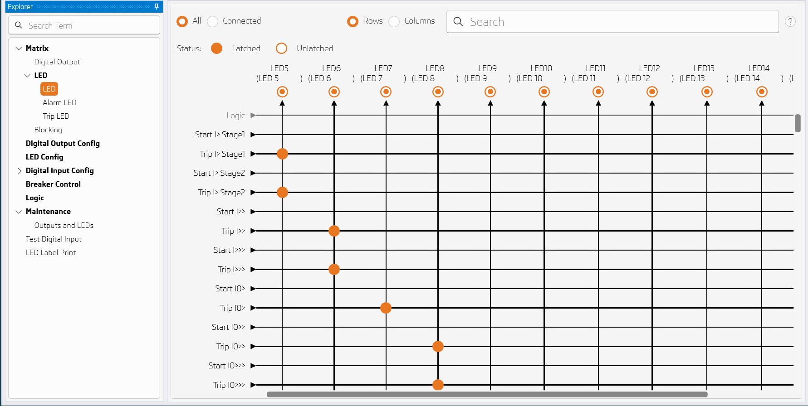

---

## Write settings progressbar
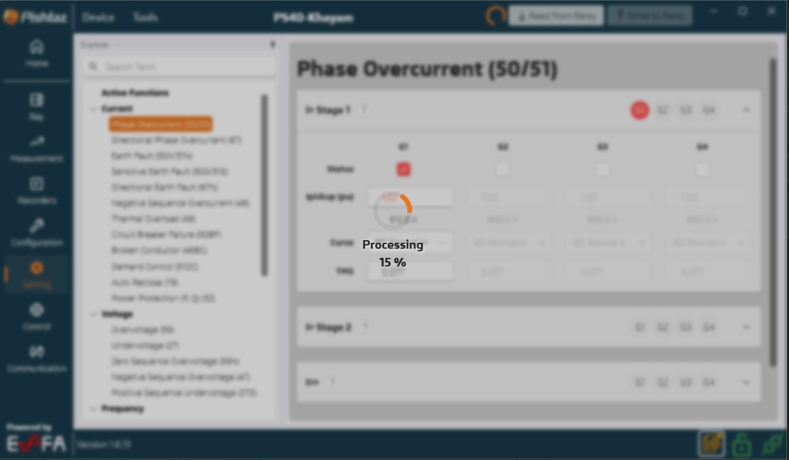

---

## Other improvements
- New software dialog button "Download Now" opens (pishtazrelay.com)
- Add new logic signals: RTC Time Loading Error, Test Mode, Block Mode, SNTP Failed
- Update system configurator library
- Fix bugs.
- UI/UX improvements.