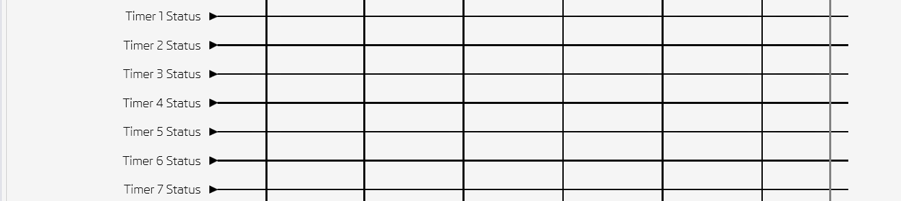
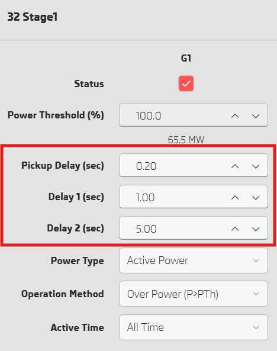

# What's New in 1.7.4

---

## Add support for firmware 1.2.0!

- Add SEF and VZero analog signals
- Add Unrestrain Restricted Earth Fault digital signals

### Add security events in recorders

### Add Control Objects in Measurements

### Add True RMS in Measurements

---

## Filter based on event type 

---

## Config Alarm and Trip LEDs 

## Column and Row lines are highlighted in output matrix 

---

## Show logic signal configuration in output matrix 

---

## Show MTA and reference voltage vectors in directional graph

---

## Add DNP3 settings

---

## Add chatter settings

---

## Add wrong attempt protection settings 

---

## Add timers settings in output matirx 

---

## Add delay settings in power protection  

---

## Decrease matrix loading time by 80%  

---

## Write settings progressbar

---

## Other improvements
- New software dialog button "Download Now" opens (pishtazrelay.com)
- Add new logic signals: RTC Time Loading Error, Test Mode, Block Mode, SNTP Failed
- Update system configurator library
- Fix bugs.
- UI/UX improvements.