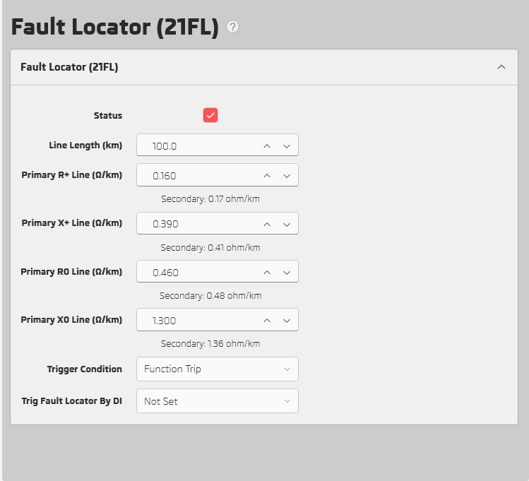

# What's New in 1.8.0

---

## Reduce Memory Consumption by 63%

### Show Equivalent Values for R+, X+, R0, X0 in Fault Locator

### Reboot Icon for Ground CT Connection Setting
- Some settings need reboot after updating. Reboot icon is shown beside these settings

### Ctrl + Click to Add Wire in Logic Diagram

---

## Filter based on event type 

---

## Config Alarm and Trip LEDs 

## Column and Row lines are highlighted in output matrix 

---

## Show logic signal configuration in output matrix 

---

## Show MTA and reference voltage vectors in directional graph

---

## Add DNP3 settings

---

## Add chatter settings

---

## Add wrong attempt protection settings 

---

## Add timers settings in output matirx 

---

## Add delay settings in power protection  

---

## Decrease matrix loading time by 80%  

---

## Write settings progressbar

---

## Other improvements
- New software dialog button "Download Now" opens (pishtazrelay.com)
- Add new logic signals: RTC Time Loading Error, Test Mode, Block Mode, SNTP Failed
- Update system configurator library
- Fix bugs.
- UI/UX improvements.