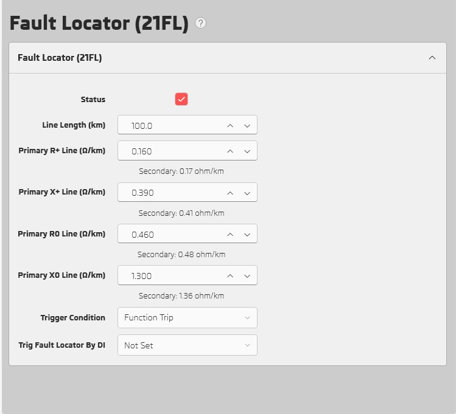
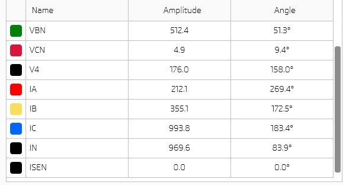
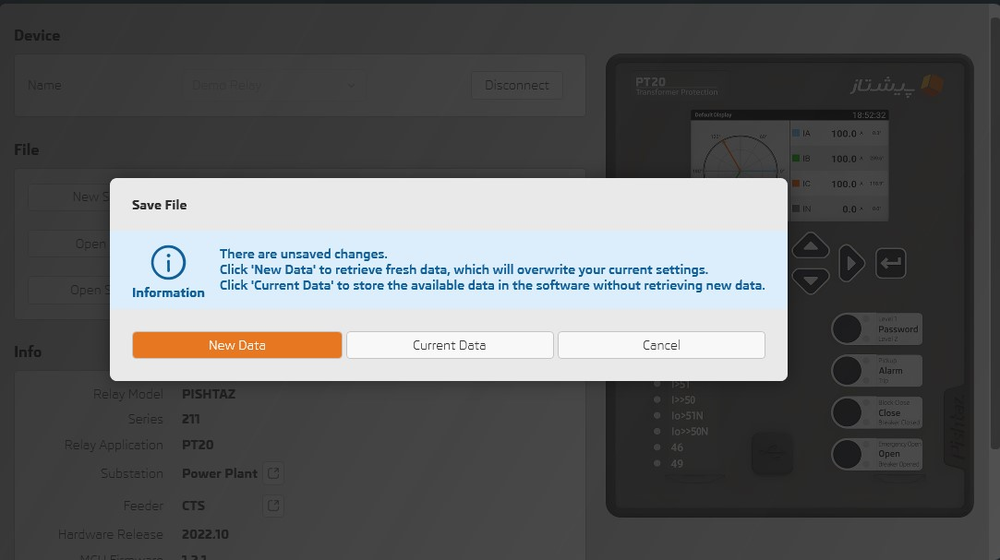

# What's New in 1.8.3

---

## Reduce Memory Consumption by 63%

---

### Show Equivalent Values for R+, X+, R0, X0 in Fault Locator

---

### Reboot Icon for Ground CT Connection Setting

- Some settings need reboot after updating. Reboot icon is shown beside these settings

---

### Press Left Alt to Add Wire in Logic Diagram

---

### User can choose what will be exported in PDF

---

### Add ISEN in phasor graph

---

### Export Excel Improvements

- User can select which settings are exported

- Settings are exported to multiple sheets

---

### Fault and Prefault Parameters Report

---

### Save Setting File Improvement

- Confirm for read from relay to save fresh data or current data when saveing setting file

---

### Directional Graph Improvement

- Show expressive labels for reference voltage and MTA points

---

## Other improvements

- Update system configurator library to 1.4.7.
- Performance imporvement in loading logic property views.
- Show unit for fault locator equivalent.
- Add Curve Type setting in DOC.
- Add "input current" selection setting for Emergency EF in VTFF.
- PISHTAZ Pro installation improvement.
- Update pishtaz manual pdf file.
- Fix wrong IN signal values.
- Fix equivalent calculated values in Cold Load Pickup settings.
- Fix bugs.
- UI/UX improvements.
