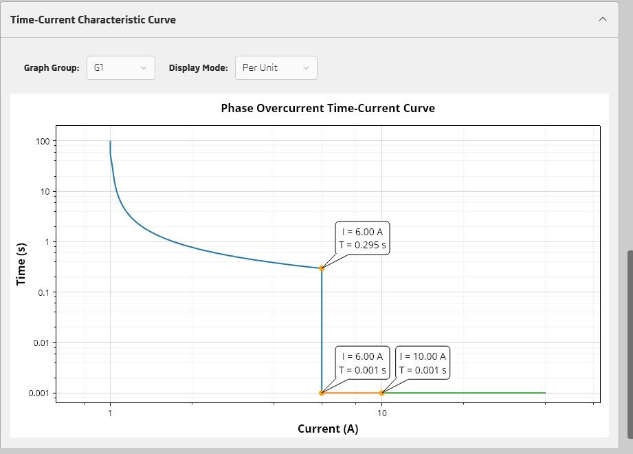

# What's New in 1.9.4

---

## Add DNP3 Settings 

---

## Add Inverse Time Curve Chart

---

## Export new face and Look

---

## Set Deadband Magnitude/Angle or Pulse Quality in Pishtaz System Configurator 

---

## Edit User-Defined points in Pishtaz System Configurator 

---

## Add New Points in Logic Signals

---

## Add Clock in Logic

----------------------

- Add new Cold Load Pickup settings 
- Add new fault signal (CLP Activated)
- Add new Thermal Overload settings
- Improve UI/UX
- Export Motor Overload and Thermal Overload in XRIO
- Improve disable line in matrix
- Use LED labels as default values in LED label print.